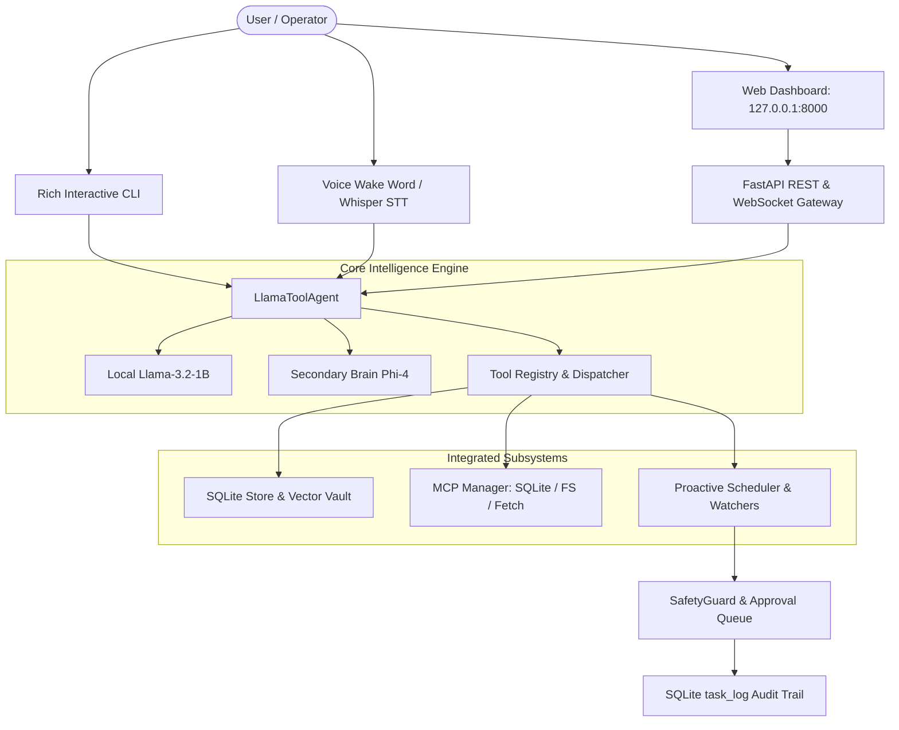

# Orvix Sphere System Architecture

```mermaid
graph TD
    User([User / Operator]) --> WebUI[Web Dashboard: 127.0.0.1:8000]
    User --> CLI[Rich Interactive CLI]
    User --> VoiceIntf[Voice Wake Word / Whisper STT]

    WebUI --> APIRouter[FastAPI REST & WebSocket Gateway]
    CLI --> LlamaAgent[LlamaToolAgent]
    VoiceIntf --> LlamaAgent
    APIRouter --> LlamaAgent

    subgraph CoreEngine ["Core Intelligence Engine"]
        LlamaAgent --> PrimaryLlama[Local Llama-3.2-1B]
        LlamaAgent --> SecondaryPhi[Secondary Brain Phi-4]
        LlamaAgent --> ToolExecutor[Tool Registry & Dispatcher]
    end

    subgraph Subsystems ["Integrated Subsystems"]
        ToolExecutor --> Knowledge[SQLite Store & Vector Vault]
        ToolExecutor --> MCP[MCP Manager: SQLite / FS / Fetch]
        ToolExecutor --> Proactive[Proactive Scheduler & Watchers]
    end

    Proactive --> SafetyGuard[SafetyGuard & Approval Queue]
    SafetyGuard --> TaskLog[SQLite task_log Audit Trail]
```
